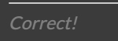

# Code Quiz

---

## Site Introduction

The code quiz enables users to begin a short five (5) question quiz over coding. The two-page site features:
* Instructions on How to Play
* Start Button
* Highscores Page
* Dynamic Timer
* Sound Effects for Correct and Incorrect Answer Choices
* Hover Elements


## Questions and Answers

```
Questions
```

Upon clicking 'Start Quiz', the timer will begin counting down from 75 seconds. A new question will be prompted with 4 possible answer choices. Possible answer choices are also differentiated by appearing within a numbered, orange box.


```
Answers
```

If the user clicks on the correct answer, the appropriate "correct" sound can be heard, and the prompt "Correct!" will appear below the 4 possible answer choices but within the solid box. No time penalties for correct answer choices.



If an incorrect answer is chosen, the appropriate "incorrect" sound can be heard, and the prompt "Wrong!" will appear below the 4 possible answer choices but within the solid box. A time penalty of 10-seconds, will also be deducted from the timer for incorrect answer choices.


## Highscores Page

The highscores page is a secondary page for displaying and viewing previous quiz attempts.
* Data of scores is stored locally.


---